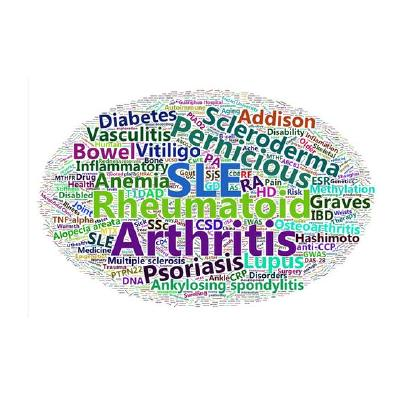

#### 华人生物工程及生物制药职业规划互助会简介

华人生物工程及生物制药职业规划互助会（Chinese BioPharma Career Networking，CBCN）是由北美，欧洲和中国从事生物医药工作的华人科学家自发组织的非营利组织。 我们旨在增进从事生物科技研究的华人之间的交流、学习和合作。 协会每周将会邀请在在工业界及学术突出的学者分享其成功的经验。个人采访及经验分享将中文或英文的形式在 YouTube Channel网站直播或录播。 欢迎从事生物医学，人工智能，计算机科学，遗传学、基因组学、生物信息学、生物统计学、进化生物学，神经生物学，分子生物学相关领域的华人同学（包括本、硕、博和博后），老师，创业人士及企业家参与。如有任何需要请来信[chinese.biopharma.career.network@gmail.com](mailto:chinese.biopharma.career.network@gmail.com)联系CBCN.

我们的愿景是构建一个扩展视野、共同成长的工业界职业发展平台。我们相信科技引领未来，但我们更认定未来不是靠一个人或一家企业创造的。在这里，我们关注创新与商机。精准医疗、基因编辑、人工智能、合成生物学等将成为核心驱动力；在这里，我们结交新朋友、分享科技动态、创业体会、项目管理、个人规划、领导力、招聘信息、业务垂询、商业动态。

CBCN每月将邀请一到两位工业界资深工作者就自己的工作进行经验分享。汇报主要以中文的形式在[YouTube](https://www.youtube.com/channel/UCeJ-M-ZRE-p0m6xuYL7cs9g) Channel播放！

**[欢迎加入我们的[Telegram](https://t.me/+8HA1KycsE8E2YWJh)，也欢迎广大华人医学工作者在此平台介绍自己的工作及研发或创业经历。

#### YouTuBe 和 twitter：

* [https://www.youtube.com/channel/UCeJ-M-ZRE-p0m6xuYL7cs9g](https://www.youtube.com/channel/UCeJ-M-ZRE-p0m6xuYL7cs9g)
* [https://twitter.com/CareerBiopharma](https://twitter.com/CareerBiopharma)

#### Linkedin和Telegram：

* [https://www.linkedin.com/groups/12692583/](https://www.linkedin.com/groups/12692583/)
* [https://t.me/+8HA1KycsE8E2YWJh](https://t.me/+8HA1KycsE8E2YWJh)

#### CBCN-Github程序集：

* [https://github.com/biopharmanetwork/biopharmanetwork.github.io](https://github.com/biopharmanetwork/biopharmanetwork.github.io)

#### CBCN-Google Group：

* [https://groups.google.com/g/chinese-biopharma-career-networking-cbcn](https://groups.google.com/g/chinese-biopharma-career-networking-cbcn)

#### 特约赞助:

**Platinum Sponsor!**

**Gold Sponsors!**

**Silver Sponsors!**

**Bronze Sponsors!**

